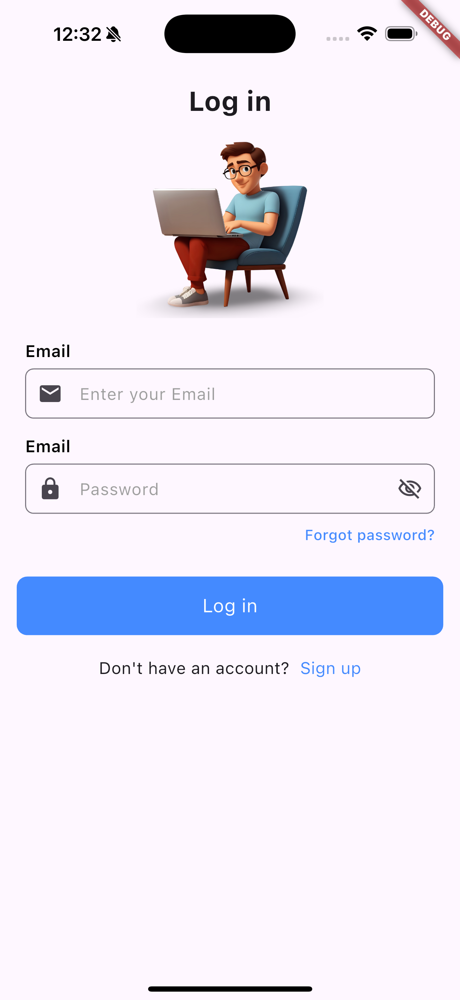
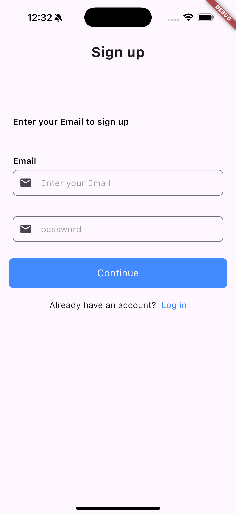
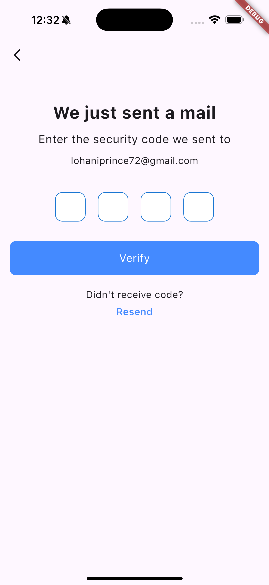
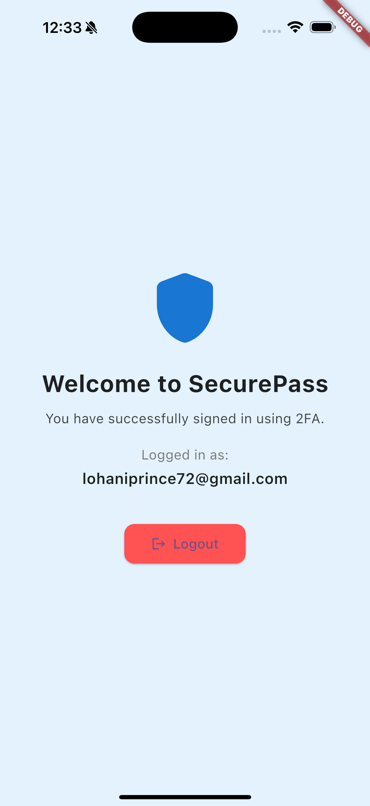

# 🔐 SecurePass - Email & OTP Authentication System

SecurePass is a two-step authentication system built using **Flutter**, **Firebase Auth**, **Firestore**, and a **custom Node.js mail server**. It adds an extra layer of security by verifying user identity via an OTP sent to their email.

---

## ✨ Features

- 🔐 **Secure Login and Signup**
- ✉️ **Email OTP Verification**
- 🔎 **Verify OTP before account creation/login**
- 👤 **Profile screen to view user details**
- 🛡 Built for security-focused apps

---

## 📱 Screenshots

| Login Screen | Signup Screen |
|--------------|---------------|
|  |  |

| OTP Verification | Profile Screen |
|------------------|----------------|
|  |  |

> Place these images in your repo under `assets/screens/` folder.

---

## 🛠️ Tech Stack

- **Flutter** – UI
- **Firebase Auth** – Email authentication
- **Cloud Firestore** – Store OTP & user data
- **Node.js + Express** – Custom Mail Server (for sending OTP)
- **HTTP Package** – To call OTP API

---

## 🚀 Getting Started

### Prerequisites

- Flutter SDK
- Firebase project (Free tier works)
- Node.js (for running the mail server)

---

### 🔧 Project Structure

```
lib/
│
├── screens/
│   ├── login_screen.dart
│   ├── signup_screen.dart
│   ├── otp_screen.dart
│   └── profile_screen.dart
│
├── services/
│   ├── auth_service.dart
│   └── mail_service.dart
│
├── widgets/
│   └── custom_button.dart
│
└── main.dart
```

---

### ⚙️ How to Run

1. Clone this repo
2. Run `flutter pub get`
3. Set up your `firebase_options.dart` using the Firebase CLI or FlutterFire UI
4. Update your backend OTP server endpoint in `mail_service.dart`
5. Run the Node.js OTP mail server:
   ```bash
   cd server
   npm install
   node index.js
   ```
6. Run the app:
   ```bash
   flutter run
   ```

---

## 📂 Backend Mail Server (Node.js)

A basic Node.js Express server is used to send OTP via email using Gmail or SES.

```bash
cd server
npm install
node index.js
```

> You can find the code in the `/server` directory of this repo.

---

## 📬 Contact

Made with ❤️ by [PriDev07](https://pridev07.xyz)
